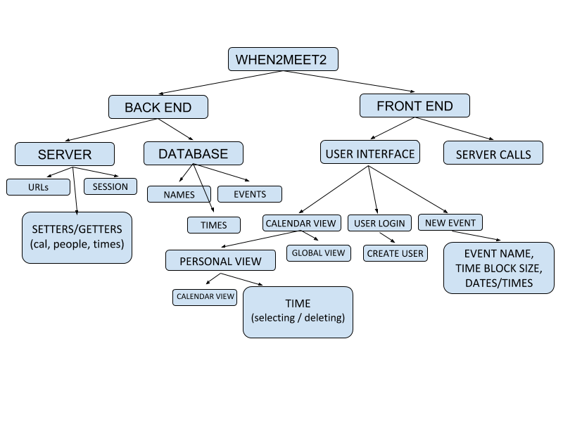

<this needs to be a reasonably resized logo>

# LetsSchedIt
A free service which helps you find the best time for a group to meet, conveniently and automatically.

## Installation & Setup
To setup the development, follow the directions below for the applications you want to install.

### Web Server
**Node.js Requirements:**
* vue
* eslint
* babel
* parcel

To install the required Node.js packages, you can simply run `npm install -r ./source/api/requirements.txt`.

### RESTful API Server
**Python Requirements:**
* flask
* Flask-RESTful
* python-dotenv
* peewee
* PyMySQL

To install the required python packages, you can simply run `pip install -r ./source/api/requirements.txt`.

MariaDB is also required to run this application. Installation varies depending on the system on which you plan on hosting the backend server. You can read installation instructions on the [official guide](https://downloads.mariadb.org/mariadb/repositories/#mirror=rackspace). To install it on Arch Linux:

```sh
  $ su -
  $ pacman -S mariadb
  $ mysql_install_db --user=mysql --basedir=/usr --datadir=/var/lib/mysql
  $ '/usr/bin/mysql_secure_installation'
```

## Usage
You can start the frontend or backend servers by changing into the appropriate directory and launching the application with the correct program.
* Frontend: `cd source/web && npm run dev`
* Backend: `cd source/api && python app.py`

## Structure


> Created by Elias Gabriel, Riya Aggarwal, Maalvika Bhat, and Dieter Brehm.
