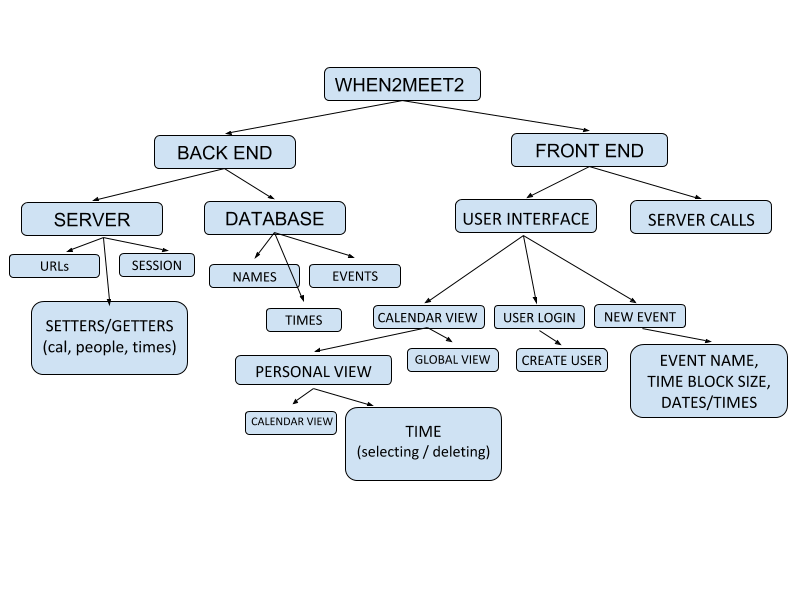
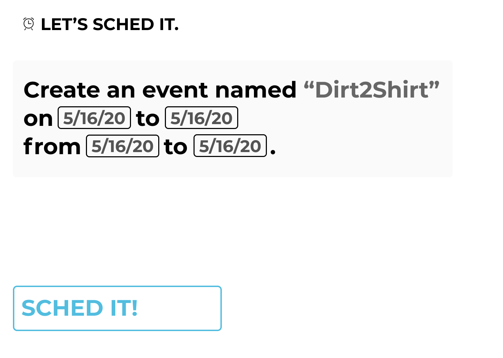
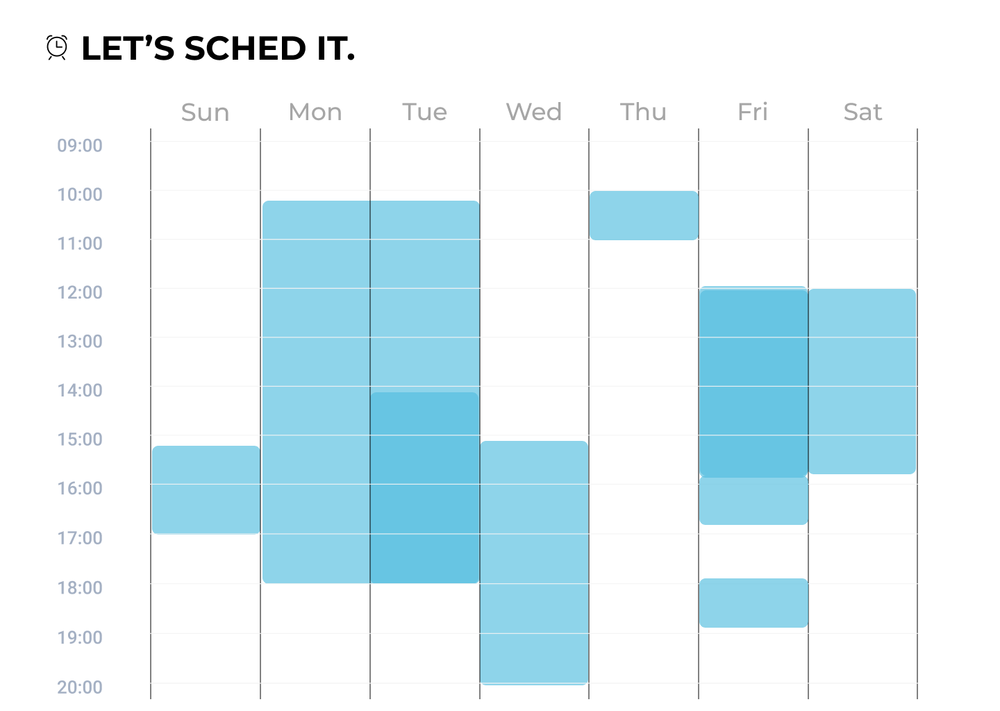

# Let's Sched It  
We wanted to make scheduling easier. So we created Let’s Sched It, a free service that helps you find the best time for a group to meet, conveniently. Instead of making users input their availability, we utilize Google and Outlook APIs in order to connect user’s calendars and import their events, saving them the time they’d spent cross-referencing.  

Consider a situation where a student is working on a team project and needs to coordinate with their classmates. The group all has their calendars setup using a service like Google Calendars but has been texting back and forth sharing their free times, only to get lost in the fray. Enter Let’s Sched It, which allows lets people schedule meeting with only a calendar link and a quick click to log in.

Created by Riya Aggarwal, Elias Gabriel, Maalvika Bhat, and Dieter Brehm.

## Installation & Setup

You can setup the server component by running
`cd source/api`, then `pip install -r requirements.txt` to install required libraries which are:  

### Backend - Deps  
* Flask  
* Requires  

### Frontend - Deps  
* vue js  
* eslint  
* babel  
* parcel  

The front end can be setup by running
`cd source/web`, then `npm install`

## Usage  
* For the frontend: run `cd source/web` and then `npm run dev`  
* For the backend:  run `cd source/api` and then `python app.py`

## Demo
Let’s walk through a typical event creator’s path using Let’s Sched It.
First, they are greeted by our homepage:  
  
After logging in, the user then enters details about the name, date and time of the event they are creating in a nice, easy-to-consume format.  
  
Next, it’s time to visualize the user’s schedule, imported from their account of choice:  
  
After three short steps, the user is able to send out the event to all participating members, and wait for the responses to roll in before setting a meeting time. That’s how we Sched It!  

## Implementation Details  
  
We were inspired by the functionality of When2Meet, a website that helps you find the best time for a group to meet. We appreciated the compactness, so events could be created and accessed quickly, but did not like the user interface, the way the website worked on a mobile device, and how you had to enter your schedule every time you were sent a When2Meet, we decided to set out to create our own platform.   
   

When we first discussed how we wanted to change When2Meet, we wanted users to be able to sync calendars with Google and Outlook as well as be able to edit calendars. Soon, we realized that we could start with being able to import calendars and add in manual entry feature afterward. We collaborated to design UI in Figma, and ran through several iterations before deciding on a homepage.  

This is what one of our first iterations of the homepage looked like. We only had an ‘Event Name’ button and a button to press to create the event.  
  
Eventually, we decided on a different style of the homepage with only the options to login with Google or Outlook, which looked like this:  
   
We were going to have sync options for the first time on the calendar page, but after our first Architectural Review and several group discussions, we decided to present the calendar differently.  
  

After learning what users wanted in the mobile view of the app, we decided to have a toggle of sorts to move back and forth between one's personal calendar and the group calendar view.  
  
  
## Privacy and Impact of Software
The primary source of possible ethical dilemmas we had to be cautious about in this project is privacy and user data handling. While we made an attempt to mitigate this potential issue by modeling our system to be calendar centric instead of user-centric, we do acknowledge that we collect users’ free time blocks through Google and Outlook API’s. The process of logging into the app does, however, clearly indicate the permissions and information being given to us through Google and Outlook.    
  
## Attribution   
  
