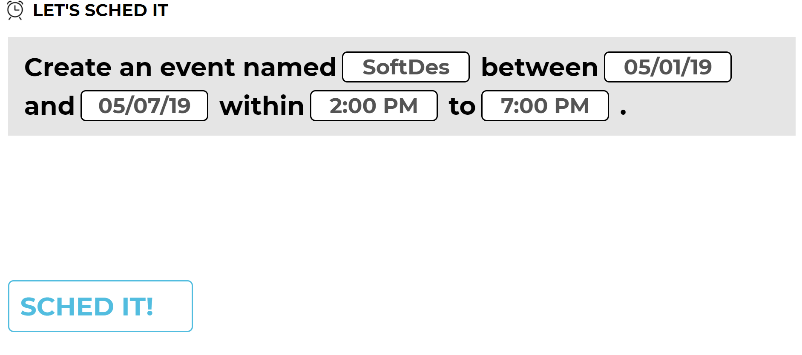
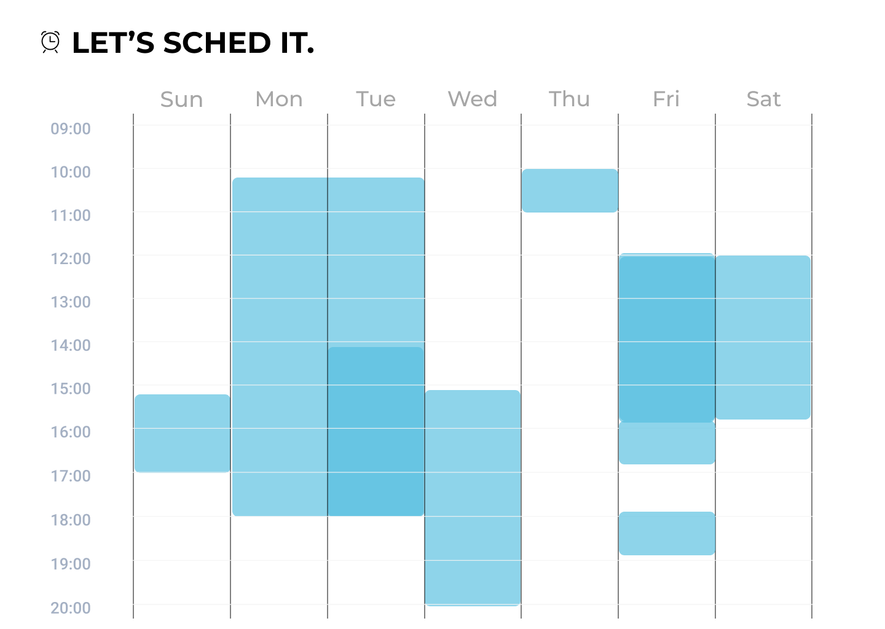
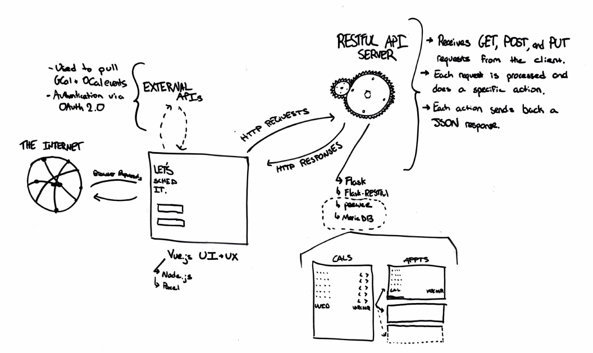
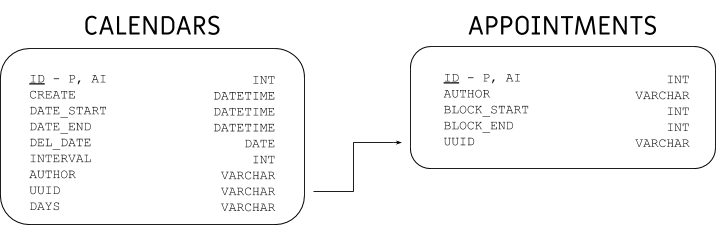
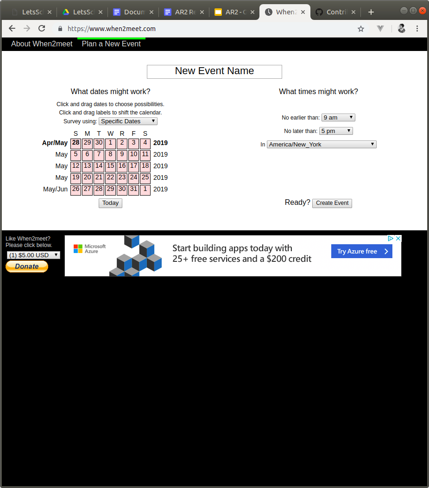
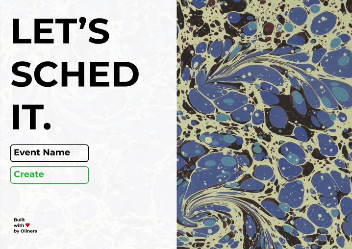
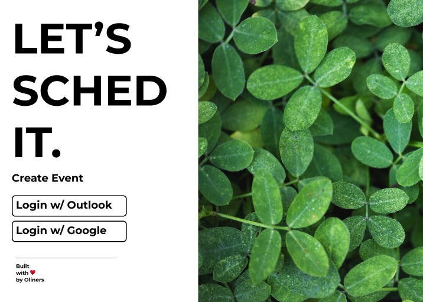
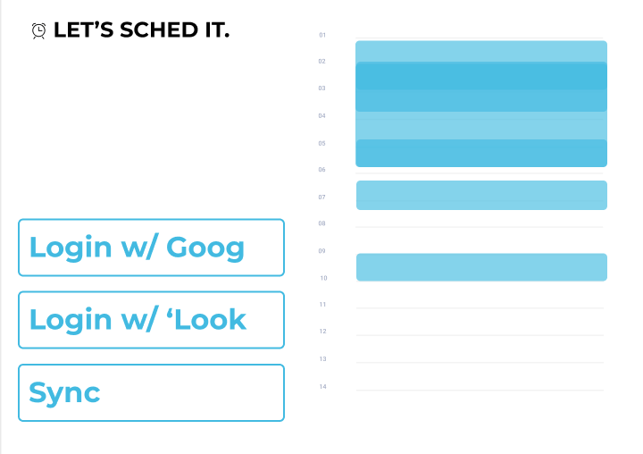
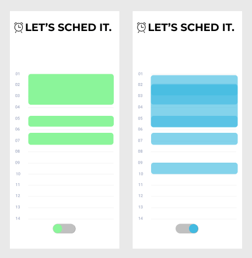

# LetsSchedIt
Consider a situation where a student is working on a team project and needs to coordinate with their classmates. The group members have their calendars set up using a service like Google or Outlook, but have been texting back and forth to share their free times. It's hectic, and messages are getting lossed or glanced over constantly.

Enter Let’s Sched It, a free service which allows people to schedule meetings with only a link and a quick click to log in. Let's Sched It helps you find the best time for a group to meet, conveniently. Instead of making users input their availabilities, we utilize Google's and Outlook's APIs in order to connect users' calendars and import their events, saving them the time they’d spend texting and cross-referencing.

Watch our pitch: [https://www.youtube.com/watch?v=6OU7aDdcucE](https://www.youtube.com/watch?v=6OU7aDdcucE)

> Created by Elias Gabriel, Maalvika Bhat, Dieter Brehm, and Riya Aggarwal.

## Installation and Usage
To setup and install the entire application stack, please read the separate [installation](/INSTALLATION.md) tutorial.

## Demo
Let’s walk through a typical event creator’s path using Let’s Sched It.
First, they are greeted by our homepage:

After logging in, the user then enters details about the name, date and time of the event they are creating in a nice, easy-to-consume format.  
  
Next, it’s time to visualize the user’s schedule, imported from their account of choice:  
  
After three short steps, the user is able to send out the event to all participating members, and wait for the responses to roll in before setting a meeting time. That’s how we Sched It!  

## Implementation Details
Our application is structured on the principle of a clearly-defined separation between the frontend UX and the backend API. When a user connects to our site, https://letsschedit.com, the request is sent to our Vue.js application. Vue.js is responsible for displaying the various pages that users will see, which are determined by the URL [code snippet](https://github.com/thearchitector/LetsSchedIt/blob/google-api/source/web/src/router.js#L10-L23).

If a user clicks login on either of the buttons on the homepage, they are redirected to an OAuth screen provided by Google or Outlook. After logging in, the user can enter the information to create their meetup event (see [Demo](#demo)). At every step along the way, a request is made to the backend API. Like with Vue.js, the backend Flask server handles each request distinctly depending on the URL [another code snippet](https://github.com/thearchitector/LetsSchedIt/blob/backend/source/api/app.py#L43-L51).

Primarily, the backend API is responsible for handing Calendar data [code snippet](https://github.com/thearchitector/LetsSchedIt/blob/backend/source/api/controllers/calendar_controller.py#L13). When the Vue.js application requests to create a new Calendar, a request is sent to the backend via HTTP and received. A new Calendar model is created, which is a representation of the data using Python objects and classes [code snippet](https://github.com/thearchitector/LetsSchedIt/blob/backend/source/api/models/calendar.py). While the data is represented as a Python model, it is not saved there. In general, all the data that is being created and saved by our application is saved within a SQL database, organized into "categories" like an Excel Spreadsheet.

Organizing data in this way, coupled with the ability to do multiple things by responding to URLs differently, has allowed us to create Let's Sched It.

## Implementation Information  
  
We were inspired by the functionality of When2Meet, a website that helps you find the best time for a group to meet. We appreciated the compactness, so events could be created and accessed quickly, but did not like the user interface, the way the website worked on a mobile device, and how you had to enter your schedule every time you were sent a When2Meet, we decided to set out to create our own platform.   
   

When we first discussed how we wanted to change When2Meet, we wanted users to be able to sync calendars with Google and Outlook as well as be able to edit calendars. Soon, we realized that we could start with being able to import calendars and add in manual entry feature afterward. We collaborated to design UI in Figma, and ran through several iterations before deciding on a homepage.  

This is what one of our first iterations of the homepage looked like. We only had an ‘Event Name’ button and a button to press to create the event.  
  
Eventually, we decided on a different style of the homepage with only the options to login with Google or Outlook, which looked like this:  
  
We were going to have sync options for the first time on the calendar page, but after our first Architectural Review and several group discussions, we decided to present the calendar differently.  
    

After learning what users wanted in the mobile view of the app, we decided to have a toggle of sorts to move back and forth between one's personal calendar and the group calendar view.  
  

## Privacy and Impact of Software
The primary source of possible ethical dilemmas we had to be cautious about in this project is privacy and user data handling. While we made an attempt to mitigate this potential issue by modeling our system to be calendar centric instead of user-centric, we do acknowledge that we collect users’ free time blocks through Google and Outlook API’s. The process of logging into the app does, however, clearly indicate the permissions and information being given to us through Google and Outlook.    

## Attribution
Our application makes use of lots of packages created by lots of lovely people.

### Web Server
* vue
* eslint
* babel
* parcel
* Jquery
* vue-fullcalendar
* axios
* vue-gapi
* moment.js

### RESTful API Server
* flask
* Flask-RESTful
* python-dotenv
* peewee
* PyMySQL
